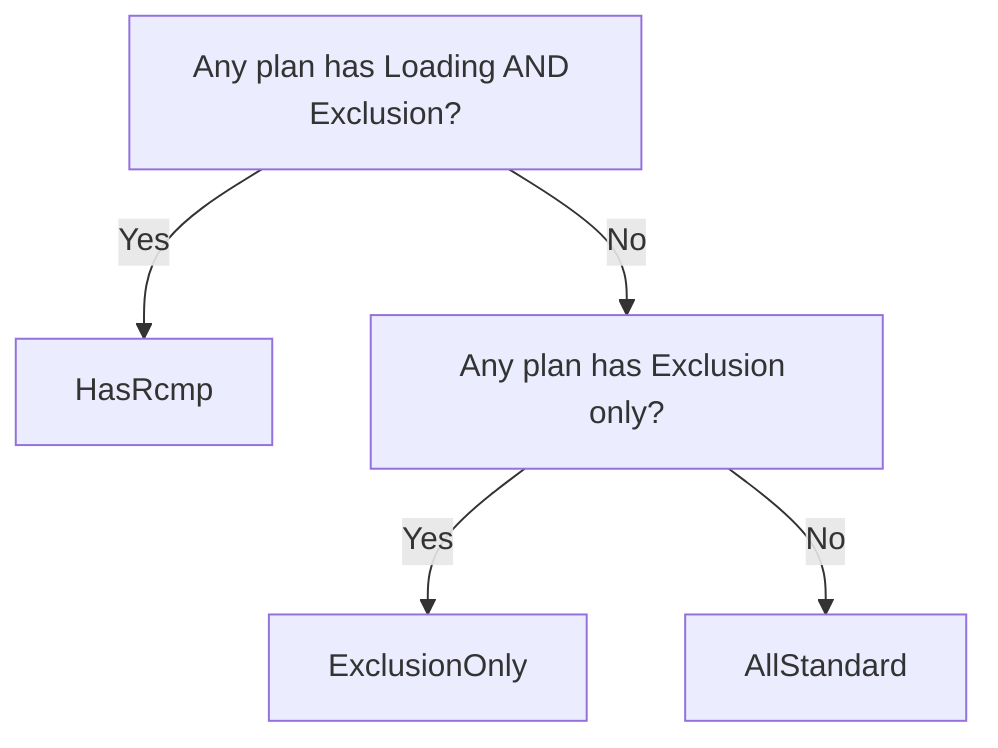
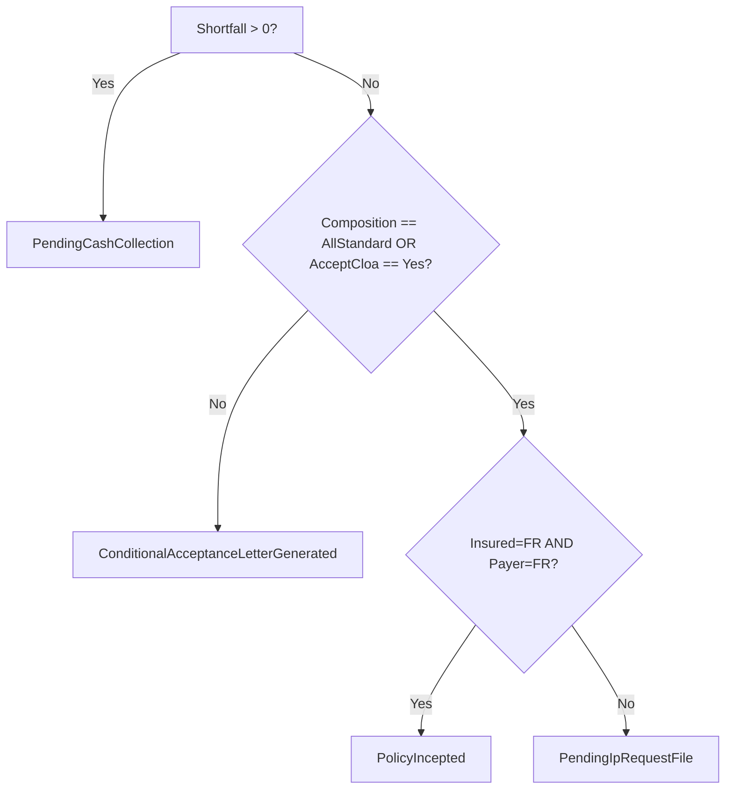

# Domain Model — Source of Truth

Enums, entities, and value-object shapes referenced by every phase and every FR. Any code drift from this file is a bug in the code, not the spec.

Language: C# (as targeted by the implementation). Types are illustrative; migrations and Fluent API belong in `MOHProject.Infrastructure` and are not part of this spec.

## Enums

### `PolicySubstatus` — 9 values (used by NB / RN / CoP / CoC)

| Name (C#) | Display | Notes |
|---|---|---|
| `PendingPpRequestFile` | PENDING PP REQUEST FILE | NTU-only entry |
| `PendingPpResponseFileCpfRejected` | PENDING PP RESPONSE FILE (CPF REJECTED) | NTU-only entry |
| `PendingManualUnderwriting` | PENDING MANUAL UNDERWRITING | Every AOR passes through here after Save |
| `PendingUwAps` | PENDING UW APS | Awaiting medical evidence |
| `ConditionalAcceptanceLetterGenerated` | CONDITIONAL ACCEPTANCE LETTER GENERATED | Entry 1.5.1 |
| `PendingUwCloaAssessment` | PENDING UW CLOA ASSESSMENT | Entry 1.5.2 |
| `PendingCashCollection` | PENDING CASH COLLECTION | Entry 1.5.3 |
| `PendingIpRequestFile` | PENDING IP REQUEST FILE | Entry 1.5.4 · terminal (non-FR) |
| `PendingIpResponseFileCpfRejected` | PENDING IP RESPONSE FILE (CPF REJECTED) | Entry 1.5.5 |
| `PolicyIncepted` | POLICY INCEPTED | Terminal (FR × FR) |

**Rule:** the enum is closed. Adding a value = spec change + version bump.

### `UwDecision` — 6 values

`Aps` · `Standard` · `Substandard` · `Declined` · `Postponed` · `NotTakenUp`

### `RiskCategory` — plan-level

`Standard` · `SubstandardExclusion` · `SubstandardLoading` · `SubstandardBoth` · `Declined` · `Postponed`

Note: `SubstandardBoth` is what the doc calls RCMP at the plan level.

### `RiskComposition` — output of composition evaluator

`AllStandard` · `ExclusionOnly` · `HasRcmp`

Priority order (highest first when evaluating): `HasRcmp` > `ExclusionOnly` > `AllStandard`.

### `RcmpOption` — 3 values

`Blank` · `Option1` · `Option2`

### `AcceptCloa` — 2 values

`Blank` · `Yes`

Modeled as its own enum (not `bool?`) because `Blank` has semantic meaning distinct from `null`.

### `Residency`

`Sg` · `Pr` · `Fr`

Rules that discriminate SG/PR from FR: use extension `residency.IsLocalResident()` (returns true for Sg or Pr).

### `ProductStatus` — plan-level

`Draft` · `Active` · `NotTakenUp` · `Postponed` · `Declined` · `Terminated` · `Cancelled` · `PendingTermination` · `PendingCashRefund`

Statuses NOT copied to renewal: everything except `Active`.

### `PolicyType`

`NewBusiness` · `Renewal` · `ChangeOfPlan` · `ChangeOfCitizenship` · `Midterm`

Rule: NB, Renewal, CoP, CoC share the core AOR pipeline. Midterm uses a separate pipeline (`ProductStatus` + `PremiumNotificationLetter`, not `Substatus` + `LOA/CLOA`).

### `LetterType`

`Loa` · `CloaExclusion` · `CloaRcmp` · `Decline` · `DeclineWithRefund` · `Postponement` · `PostponementWithRefund` · `NtuWithoutRefund` · `NtuWithRefund` · `RefundOfExcessPremium` · `MedicalEvidence` · `PremiumNotification` (Midterm only)

## Value objects

### `Money`
- `decimal Amount`
- `string Currency` (default `SGD`)
- Immutable. Arithmetic operators must throw on mixed-currency addition.

### `RiskAssessment` — per-plan
- `bool HasActiveRiskLoading`
- `bool HasActiveExclusion`
- Derives `RiskCategory` via a pure function; do not store `RiskCategory` separately if it can be derived.

### `ResidencyPair`
- `Residency Insured`
- `Residency Payer`
- Method: `bool IsFrFr() => Insured == Fr && Payer == Fr;`
- Method: `bool RequiresIpFile() => Insured.IsLocal() || Payer.IsLocal();`

## Entities

### `Policy` (aggregate root)
Fields:
- `long Id`
- `string PolicyNumber` (e.g. `2610000310P`)
- `PolicyType Type`
- `PolicySubstatus Substatus`
- `Residency InsuredResidency`
- `Residency PayerResidency`
- `DateTime? UwCompletedAt`
- `byte[] RowVersion` (concurrency)

Collections:
- `IReadOnlyCollection<Plan> Plans` (1 base + N riders)
- `UWState UWState` (1:1, owned)
- `PremiumCollection PremiumCollection` (1:1, owned)
- `IReadOnlyCollection<Letter> Letters` (append-only)
- `IReadOnlyCollection<AuditEntry> AuditEntries` (append-only)

Invariants:
- Exactly one `Plan` where `IsBase == true`.
- `Substatus` transitions must be recorded in `AuditEntries`.
- Direct field mutation is disallowed; go through domain methods (`ApplyUwDecision`, `MarkRiderNtu`, etc.) that emit audit + domain events.

### `Plan`
- `long Id`, `long PolicyId`
- `bool IsBase`
- `string ProductCode` (Base, Premier, Choice, CancerGuard, ...)
- `ProductStatus Status`
- `RiskAssessment RiskAssessment`
- `Money GrossPremium`
- `Money PrivateInsuranceExtraPremium`
- `DateTime? AddedAt` — used to distinguish "newly added" for letter inclusion rules
- `DateTime? StatusChangedAt`
- `bool IsSelectedInProductTab` — controls visibility in the NTU/Termination Rider section

Rule (§Bug 2, source lines 1990-1994): when a plan transitions to NTU/Declined/Postponed, its `PrivateInsuranceExtraPremium` and `GrossPremium` **retain** the pre-transition loading amounts (for historical display) — they are not zeroed out.

### `UWState` (owned by Policy)
- `bool RcmpFlag`
- `bool RcmpFlagEnabled` — `false` means "greyed"
- `AcceptCloa AcceptCloa`
- `bool AcceptCloaEnabled`
- `RcmpOption RcmpOption`
- `bool RcmpOptionEnabled`
- `bool CompleteUw`
- `RiskComposition CurrentComposition` (derived, cached after each evaluation)

Rule: greyed + blank fields serialize as their enum's blank/false variants — do not use `null` to represent "greyed."

### `PremiumCollection` (owned by Policy)
Base + Rider tracked separately:
- `Money BaseToCollect`, `Money BaseCollected`
- `Money LinkedRidersToCollect`, `Money LinkedRidersCollected`
- `Money UnallocatedCash`

Derived:
- `Money BaseShortfall => Max($0, BaseToCollect − BaseCollected)`
- `Money LinkedRidersShortfall => Max($0, LinkedRidersToCollect − LinkedRidersCollected)`
- `Money TotalShortfall => BaseShortfall + LinkedRidersShortfall`

Excess handling (fix for §Enhancement 3, source lines 260-266):
- If `Collected > ToCollect`, the excess amount is added to `UnallocatedCash` **and** a `RefundOfExcessPremium` letter is queued.
- Shortfall must never serialize as negative.

### `Letter` (append-only)
- `long Id`, `long PolicyId`
- `LetterType Type`
- `DateTime IssuedAt`
- `IReadOnlyCollection<long> IncludedPlanIds` (which plans appear in this letter)
- `bool IsCurrent` — set false when a superseding letter is issued (§FR-REM-001)
- `Guid CorrelationId` — links parent letter to its reminders

Rule: letters are immutable once written. "Regenerating" means marking the old letter `IsCurrent = false` and writing a new row.

### `Reminder`
- `long Id`, `long PolicyId`, `long ParentLetterId`
- `LetterType ReminderType` (`LoaReminder`, `LoaFinalReminder`, `CloaReminder`, `CloaFinalReminder`)
- `DateTime ScheduledFor`
- `ReminderStatus Status` (`Scheduled` · `Sent` · `Cancelled`)

Rule: when parent letter's `IsCurrent` flips to false, all `Scheduled` reminders under that `CorrelationId` transition to `Cancelled`.

### `AuditEntry` (append-only)
- `long Id`, `long PolicyId`
- `DateTime OccurredAt`
- `string ActorUserId`
- `string EventType` (e.g. `SubstatusChanged`, `RiderNtu`, `LetterIssued`, `SubmitForUnderwritingReview`)
- `string PayloadJson` — before/after snapshot

Rule (§Enhancement 1, source line 233): the phrase "Submit for underwriting review" replaces the old "user manual submit for underwriting review" text.

### `Insured`, `Payer`, `PolicyHolder`
Trimmed to what the AOR logic needs; other CRM concerns are out of scope:
- `Residency Residency`
- `DateTime DateOfBirth` (needed for §FR-MED-001 — Medisave age-25 trigger)
- `string ExternalId` (link to master data)

## Service contracts (interfaces)

Owned by `MOHProject.Application/Ports/` — implementations live in `Domain` (pure) or `Infrastructure` (I/O).

### `IRemainingPlansEvaluator` — the orchestrator
```csharp
public interface IRemainingPlansEvaluator
{
    EvaluationResult EvaluateAfterAction(
        Policy policy,
        PolicyContext context);
}

public sealed record EvaluationResult(
    RiskComposition Composition,
    PolicySubstatus NextSubstatus,
    LetterType? LetterToGenerate,
    bool LetterHasAcknowledgementPage,
    UWState UpdatedUWState);
```
Pure. No I/O. Idempotent.

Composed of 4 sub-evaluators, each individually unit-testable:
- `IPlansCompositionEvaluator` → `RiskComposition`
- `IUwFieldStatesEvaluator` → `UWState`
- `INextSubstatusEvaluator` → `PolicySubstatus`
- `ILetterTypeEvaluator` → `(LetterType?, bool hasAck)`

### `ILetterGenerator`
```csharp
public interface ILetterGenerator
{
    Task<Letter> GenerateAsync(long policyId, LetterType type, CancellationToken ct);
}
```
Emits a new `Letter` row, marks superseded prior letters `IsCurrent = false`, cancels their scheduled reminders.

### `IReminderScheduler`
```csharp
public interface IReminderScheduler
{
    Task ScheduleFromAsync(Letter letter, CancellationToken ct);
    Task CancelForAsync(Guid correlationId, CancellationToken ct);
}
```
Implementation: Hangfire (proposed). Persists queue in SQL Server so scheduling survives restart.

### `IAuditTrailWriter`
```csharp
public interface IAuditTrailWriter
{
    Task WriteAsync(long policyId, string eventType, object payload, CancellationToken ct);
}
```

## Diagrams (mermaid)

### Composition priority


### Terminal substatus decision


## Open questions
- **Q-101:** `LinkedRiders*` — is there a single bucket or one per rider product code? The doc shows a single "Linked Rider(s) Cash (RHI)" bucket, but Change of Plan implies per-rider allocation. Defer to §FR-COP resolution.
- **Q-102:** `Money.Currency` — is multi-currency in scope? SG-only market suggests no; confirm before adding currency arithmetic complexity.
- **Q-103:** Concurrency model — optimistic (RowVersion) proposed; confirm with BA whether pessimistic locking on a policy during UW is required.

## Change log
| Date       | Version | Change          | Author |
|------------|---------|-----------------|--------|
| 2026-07-11 | 0.1     | Initial draft   | Claude |
